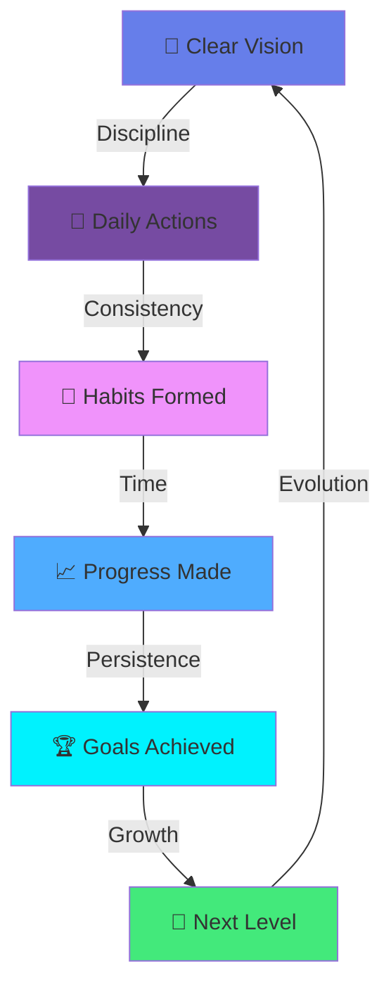

<div align="center">

<!-- Animated Header -->


<h3>
  
</h3>

[](https://example.com)
[](https://example.com)
[](https://example.com)


</div>

---

## 🚀 Transformation Overview

<table align="center">
<tr>
<td align="center" width="33%">

<br><b>English Mastery</b>
<br><sub>4 Core Skills Development</sub>
</td>
<td align="center" width="33%">

<br><b>Holistic Wellness</b>
<br><sub>Mind • Body • Soul Balance</sub>
</td>
<td align="center" width="33%">

<br><b>Career Excellence</b>
<br><sub>Jobs • Freelancing • Growth</sub>
</td>
</tr>
</table>

<div align="center">

</div>

---

## 🎯 R → English Language Mastery

<details open>
<summary><b>📚 Comprehensive Language Development (Click to expand)</b></summary>
<br>

### 🌍 Core Learning Platform

| Icon | Platform | Purpose |
|:----:|:---------|:--------|
| 🦜 | **Duolingo** | Daily structured learning & practice |
| 📱 | **Gamified Approach** | Consistent engagement & streak building |
| 🎯 | **Skill Tracking** | Measurable progress & achievements |

### 🗣️ Speaking Excellence

| Icon | Method | Tool | Focus |
|:----:|:-------|:-----|:------|
| 🤖 | **AI Conversation** | ChatGPT, Voice AI | Real-time speaking practice |
| 💬 | **Daily Practice** | AI Voice Chat | Pronunciation & fluency |
| 🎙️ | **Interactive Dialogue** | AI Language Partners | Natural conversation flow |
| 📊 | **Feedback Loop** | AI Analysis | Accent improvement & clarity |

**Speaking Routine:**
- ✅ 15-30 minutes daily AI conversation
- ✅ Focus on pronunciation and natural flow
- ✅ Record and review progress weekly
- ✅ Practice different topics and scenarios

### ✍️ Writing Mastery

| Icon | Method | Tool | Focus |
|:----:|:-------|:-----|:------|
| 📝 | **AI-Assisted Writing** | ChatGPT, Grammarly | Grammar & style improvement |
| ✨ | **Creative Writing** | Writing AI Tools | Expression & vocabulary |
| 📧 | **Professional Communication** | AI Editors | Business writing skills |
| 🔄 | **Iterative Improvement** | AI Feedback | Error correction & learning |

**Writing Routine:**
- ✅ Write daily journal entries in English
- ✅ Practice different formats (emails, essays, stories)
- ✅ Get AI feedback and corrections
- ✅ Implement improvements consistently

### 👂 Listening Comprehension

| Icon | Method | Source | Focus |
|:----:|:-------|:-------|:------|
| 🎧 | **Active Listening** | English Courses | 100% comprehension goal |
| 📹 | **Video Content** | Educational Videos | Understanding context |
| 🎬 | **Entertainment** | Movies, Podcasts | Natural speech patterns |
| 🔁 | **Repetition Strategy** | Rewatch until mastery | Deep understanding |

**Listening Strategy:**
```
🎯 Focus Area: Complete Understanding
    ├── 🎓 Educational Content (Primary)
    │   └── Listen until you understand EVERYTHING
    ├── 🗣️ Native Speakers (Practice)
    │   └── Adapt to different accents & speeds
    ├── 📚 Course Material (Deep Learning)
    │   └── Comprehensive comprehension
    └── 🎵 Variety Content (Exposure)
        └── Diverse topics & speaking styles
```

### 📖 Reading Proficiency

| Icon | Method | Tool | Focus |
|:----:|:-------|:-----|:------|
| 📚 | **NotebookLM Study** | Google NotebookLM | Deep book comprehension |
| 📱 | **AI-Powered Learning** | NotebookLM Audio | Multi-sensory learning |
| 🎯 | **Strategic Reading** | Every book you own | Complete understanding |
| 💡 | **Active Processing** | AI Summaries & Q&A | Retention & application |

**Reading Approach:**
1. 📥 Upload book to NotebookLM
2. 🎧 Listen to AI-generated audio overview
3. 📝 Read with AI assistance for difficult parts
4. 💬 Discuss concepts with AI for deeper understanding
5. ✅ Summarize key learnings in your own words

</details>

<div align="center">

</div>

---

## 🧘 R → Mind & Soul & Body Harmony

<details open>
<summary><b>✨ Soul - Spiritual Foundation (Click to expand)</b></summary>
<br>

### 🕌 Spiritual Discipline

| Icon | Practice | Schedule | Benefit |
|:----:|:---------|:---------|:--------|
| 🕌 | **Five Daily Prayers** | On Time - Every Prayer | Spiritual connection & discipline |
| ⏰ | **Punctuality** | Never miss prayer time | Time management & mindfulness |
| 🙏 | **Focused Worship** | Quality over quantity | Inner peace & clarity |

### 🛡️ Spiritual Protection

| Icon | Practice | Implementation | Impact |
|:----:|:---------|:---------------|:-------|
| 🚫 | **Avoid All Sins** | Constant awareness | Purity of heart & mind |
| 💎 | **Special Focus** | Sins that arouse desire | Self-control & discipline |
| ✨ | **Pure Lifestyle** | Guard eyes, heart, actions | Mental clarity & focus |
| 🌟 | **Mindful Living** | Every action intentional | Spiritual elevation |

</details>

<details open>
<summary><b>💪 Body - Physical Excellence (Click to expand)</b></summary>
<br>

### 😴 Sleep Optimization

| Icon | Parameter | Schedule | Benefit |
|:----:|:----------|:---------|:--------|
| 🌙 | **Sleep Time** | 10:00 PM - 5:00 AM | 7 hours quality sleep |
| ⏰ | **Consistency** | Every single night | Circadian rhythm optimization |
| 🛌 | **Sleep Quality** | Dark room, cool temp | Deep recovery & restoration |
| ☀️ | **Morning Energy** | Wake at 5 AM | Maximum productivity hours |

**Sleep Routine:**
```
🌅 Evening Routine (9:00 PM)
    ├── 📵 No screens after 9 PM
    ├── 📖 Light reading or reflection
    ├── 🧘 Relaxation exercises
    └── 🛌 Sleep by 10 PM sharp

🌄 Morning Routine (5:00 AM)
    ├── ☀️ Wake immediately (no snooze)
    ├── 🕌 Fajr prayer
    ├── 📚 Quran or beneficial reading
    └── 🏃 Begin productive day
```

### 🍽️ Nutrition Protocol

| Icon | Meal | Timing | Focus |
|:----:|:-----|:-------|:------|
| 🌅 | **Breakfast** | After Fajr (6:00 AM) | Protein + complex carbs |
| ☀️ | **Lunch** | 1:00 PM | Balanced macros |
| 🌙 | **Dinner** | 7:00 PM | Light, digestible |

**Nutrition Principles:**
- ✅ Three complete, balanced meals daily
- ✅ No skipping meals - consistency is key
- ✅ Proper hydration throughout the day
- ✅ Whole foods, minimal processed items
- ✅ Adequate protein for muscle recovery

### 💊 Daily Supplements

| Icon | Category | Purpose | Timing |
|:----:|:---------|:--------|:-------|
| 💊 | **Essential Vitamins** | Overall health | Morning with breakfast |
| 🦴 | **Minerals** | Bone & muscle health | With meals |
| 🧠 | **Cognitive Support** | Mental clarity | Morning |
| 💪 | **Fitness Support** | Recovery & performance | Post-workout |

**Supplement Checklist:**
- ☑️ Morning supplements with breakfast
- ☑️ Pre-workout supplements (if applicable)
- ☑️ Post-workout recovery
- ☑️ Evening supplements (if prescribed)
- ☑️ Never skip - daily consistency

### 🤸 Calisthenics Training

| Icon | Focus | Exercises | Frequency |
|:----:|:------|:----------|:----------|
| 💪 | **Upper Body** | Push-ups, Pull-ups, Dips | 3-4x per week |
| 🦵 | **Lower Body** | Squats, Lunges, Pistols | 3-4x per week |
| 🧘 | **Core** | Planks, L-sits, Hollow holds | Daily |
| 🏃 | **Cardio** | Running, Jumping rope | 3x per week |

**Training Philosophy:**
```
🎯 Calisthenics Benefits
    ├── 💪 Functional strength
    ├── 🧘 Body control & coordination
    ├── 🏠 Train anywhere, anytime
    ├── 🎯 Progressive skill development
    └── 🧠 Mind-muscle connection
```

</details>

<details open>
<summary><b>🧠 Mind - Mental Mastery (Click to expand)</b></summary>
<br>

### ⚡ Core Mental Pillars

| Icon | Pillar | Implementation | Outcome |
|:----:|:-------|:---------------|:--------|
| 🎯 | **Discipline** | Daily non-negotiables | Unwavering consistency |
| 🔄 | **Habit Building** | Systematic routine creation | Automatic excellence |
| ⏰ | **Time Management** | Strategic scheduling | Maximum productivity |

### 📚 Reading & Learning

| Icon | Focus | Method | Goal |
|:----:|:------|:-------|:-----|
| 📖 | **Read All Books** | Every book you own | Complete library |
| 🎧 | **NotebookLM** | AI-assisted understanding | Deep comprehension |
| 📝 | **Active Reading** | Notes & summaries | Knowledge retention |
| 💡 | **Application** | Implement learnings | Real-world results |

**Reading System:**
1. 📚 Catalog all unread books
2. 📅 Create reading schedule
3. 🎯 One book at a time - finish before starting next
4. 📝 Take detailed notes
5. 💬 Discuss with AI for deeper understanding
6. ✅ Apply key concepts immediately

### 🎮 Dopamine Management

| Icon | Strategy | Action | Result |
|:----:|:---------|:-------|:-------|
| 🌱 | **Natural Generation** | Exercise, achievement, learning | Sustainable energy |
| 🚫 | **Stop Consumption** | Limit social media, gaming, junk content | Mental clarity |
| 🎯 | **Delayed Gratification** | Work before pleasure | Increased willpower |
| ⚡ | **Productive Highs** | Celebrate real accomplishments | Authentic motivation |

**Dopamine Detox Protocol:**
```
❌ Reduce/Eliminate:
    ├── 📱 Mindless social media scrolling
    ├── 🎮 Excessive gaming
    ├── 🍔 Junk food
    ├── 📺 Binge-watching
    └── 🔞 All inappropriate content

✅ Increase Natural Dopamine:
    ├── 💪 Exercise & movement
    ├── 🎯 Completing challenging tasks
    ├── 📚 Learning new skills
    ├── 🤝 Meaningful social connections
    └── 🏆 Achieving goals
```

### 🤖 AI Usage Philosophy

| Icon | Principle | Implementation | Benefit |
|:----:|:----------|:---------------|:--------|
| 🎯 | **Use Less** | Only when necessary | Self-reliance development |
| 🧠 | **Understand Deeply** | Never copy-paste blindly | True learning |
| 💡 | **Question Everything** | Why does this work? | Deep comprehension |
| 🔧 | **Adapt & Modify** | Make it yours | Original thinking |

**AI Interaction Guidelines:**
- ✅ Use AI as a teacher, not a shortcut
- ✅ Always understand before implementing
- ✅ Ask "why" and "how" questions
- ✅ Create your own solutions first, then verify
- ✅ Use AI to enhance, not replace, thinking

### 🛡️ Mental + Psychological + Physical Toughness

| Icon | Type | Training Method | Application |
|:----:|:-----|:----------------|:------------|
| 💪 | **Physical** | Calisthenics, cold showers | Body resilience |
| 🧠 | **Mental** | Challenging tasks, focus training | Mind endurance |
| 💎 | **Psychological** | Discomfort tolerance, discipline | Emotional strength |
| 🔥 | **Combined** | Push beyond comfort zone daily | Unbreakable character |

**Toughness Development:**
```
🎯 Daily Toughness Rituals
    ├── 🚿 Cold showers (5 minutes)
    ├── 🏃 Early morning workout
    ├── 📖 Read difficult material
    ├── 🎯 Do the hardest task first
    ├── 🚫 Say no to temptations
    └── ⏰ Stick to schedule no matter what
```

### 📺 Wisdom & Self-Knowledge

| Icon | Teacher | Content Focus | Purpose |
|:----:|:--------|:--------------|:--------|
| 🎥 | **Amr Abdelaziz** | Identity & purpose | Who you are |
| 📚 | **Historical Context** | Understanding roots | What got us here |
| 🎯 | **Duties & Responsibilities** | Life mission | What you must do |

**Learning Framework:**
1. 🎬 Watch Amr Abdelaziz's videos systematically
2. 📝 Take detailed notes on key concepts
3. 🤔 Reflect deeply on each lesson
4. 💬 Discuss insights with trusted people
5. 🎯 Apply teachings to daily life
6. 🔄 Revisit and reinforce regularly

</details>

<div align="center">

</div>

---

## 💼 R → Money & Jobs & Freelancer Success

<details open>
<summary><b>🎯 Job Search Excellence (Click to expand)</b></summary>
<br>

### 📊 Daily Job Search Protocol

| Icon | Action | Platform | Frequency |
|:----:|:-------|:---------|:----------|
| 🔍 | **Active Search** | LinkedIn, Indeed, Wuzzuf | Daily |
| 📝 | **Applications** | Multiple platforms | Minimum 3-5 per day |
| 🎯 | **Targeted Approach** | Relevant positions only | Quality over quantity |
| 📧 | **Follow-ups** | Track applications | Weekly review |

**Daily Job Search Routine:**
```
⏰ Daily Schedule (1-2 hours)
    ├── 🔍 Search new postings (30 min)
    ├── 📝 Customize CV for each role (30 min)
    ├── ✍️ Write personalized cover letters (20 min)
    ├── 📤 Submit applications (10 min)
    └── 📊 Track in spreadsheet (10 min)
```

### 🎯 Application Tracking System

| Date | Company | Position | Platform | Status | Follow-up |
|:----:|:--------|:---------|:---------|:-------|:----------|
| Example | Company Name | Job Title | LinkedIn | Applied | Date + 1 week |

</details>

<details open>
<summary><b>💰 Freelancing Platforms Management (Click to expand)</b></summary>
<br>

### 🌟 Mostaql (مستقل) Strategy

| Icon | Action | Timing | Purpose |
|:----:|:-------|:-------|:--------|
| 🔔 | **Regular Checks** | Every 2-3 hours | Catch new projects early |
| 📱 | **Mobile Alerts** | Enable notifications | Never miss opportunities |
| 💬 | **Quick Response** | Within 1 hour | Beat competition |
| 🎯 | **Strategic Bidding** | Quality proposals | Higher acceptance rate |

**Mostaql Optimization:**
- ✅ Set up push notifications
- ✅ Check morning, afternoon, evening
- ✅ Prepare template proposals (customize per project)
- ✅ Maintain high response rate
- ✅ Build strong portfolio with completed projects

### 🛍️ Khamsat (خمسات) Excellence

| Icon | Focus | Action | Goal |
|:----:|:------|:-------|:-----|
| 📚 | **Study Platform** | Understand best sellers | Market knowledge |
| 📈 | **Improve Accounts** | Optimize profile & services | Higher visibility |
| 🎯 | **Add Projects** | Create marketable services | Passive income |
| 💰 | **Pricing Strategy** | Competitive but valuable | Attract buyers |

**Khamsat Service Development:**
```
🎯 Service Creation Strategy
    ├── 📊 Research trending services
    ├── 🎨 Create compelling service images
    ├── ✍️ Write clear descriptions
    ├── 💎 Offer unique value propositions
    ├── 📦 Package services (basic, standard, premium)
    └── 🔄 Update based on feedback
```

**Service Categories to Develop:**
1. 🎨 Design services (based on Canva skills)
2. 📝 Content writing (English + Arabic)
3. 💻 WordPress setup/customization
4. 🎬 Video editing (DaVinci Resolve)
5. 🤖 Marketing automation (n8n workflows)

</details>

<details open>
<summary><b>📄 Professional Profile Management (Click to expand)</b></summary>
<br>

### 🔄 Weekly Review Schedule

| Icon | Asset | Review Day | Action Items |
|:----:|:------|:-----------|:-------------|
| 📄 | **CV** | Sunday | Update, optimize, tailor |
| 💼 | **LinkedIn** | Monday | Post, engage, connect |
| 🔍 | **Wuzzuf** | Tuesday | Profile update, job search |
| 💻 | **GitHub** | Wednesday | Push projects, update README |
| 🌐 | **Freelancer Profiles** | Thursday | Portfolio updates, proposals |

**Weekly Review Checklist:**

#### 📄 CV Optimization
- ☑️ Add recent skills/certifications
- ☑️ Update project descriptions
- ☑️ Quantify achievements with numbers
- ☑️ Customize for target industries
- ☑️ Proofread for errors
- ☑️ Update contact information
- ☑️ Optimize keywords for ATS

#### 💼 LinkedIn Profile
- ☑️ Update headline with current focus
- ☑️ Refresh about section
- ☑️ Add recent projects/achievements
- ☑️ Post valuable content (2-3x per week)
- ☑️ Engage with others' posts (daily)
- ☑️ Accept/send connection requests
- ☑️ Endorse connections' skills

#### 🔍 Wuzzuf Profile
- ☑️ Keep profile 100% complete
- ☑️ Update availability status
- ☑️ Add new skills
- ☑️ Upload latest CV
- ☑️ Set job preferences accurately
- ☑️ Respond to recruiter messages quickly

#### 💻 GitHub Portfolio
- ☑️ Push active projects
- ☑️ Update README files
- ☑️ Add project descriptions
- ☑️ Include screenshots/demos
- ☑️ Pin best repositories
- ☑️ Contribute to open source
- ☑️ Keep commit history active

#### 🌐 Freelancer Profiles
- ☑️ **Mostaql**: Update portfolio, add completed projects
- ☑️ **Khamsat**: Add new services, update existing ones
- ☑️ **Upwork/Freelancer.com**: Refresh profile, update skills
- ☑️ All platforms: Maintain 100% profile completion
- ☑️ Add client testimonials when received
- ☑️ Update availability status

</details>

<details open>
<summary><b>🤝 Networking & Recommendations (Click to expand)</b></summary>
<br>

### 🌐 Network Expansion Strategy

| Icon | Action | Method | Frequency |
|:----:|:-------|:-------|:----------|
| 📧 | **Send CV** | Email campaigns | 5-10 per week |
| 🤝 | **Connect** | LinkedIn outreach | Daily |
| 💬 | **Engage** | Comment, share, message | Daily |
| 🙏 | **Request Recommendations** | From previous clients/colleagues | Monthly |

**Networking Action Plan:**

#### 📧 CV Distribution Strategy
```
🎯 Target Recipients
    ├── 👔 Hiring Managers (Direct approach)
    ├── 👥 Industry Professionals (Referrals)
    ├── 🏢 Company HR departments
    ├── 🎓 Alumni network
    └── 🤝 Professional connections
```

**Email Template Structure:**
1. 👋 Personalized greeting
2. 🎯 Brief introduction (2-3 lines)
3. 💎 Value proposition (what you offer)
4. 📎 CV attachment
5. 🙏 Call to action (meeting/interview request)
6. ✅ Professional signature

#### 🤝 LinkedIn Networking Tactics

| Icon | Tactic | Implementation | Goal |
|:----:|:-------|:---------------|:-----|
| 🔍 | **Strategic Connections** | 10-15 new connections daily | Expand network |
| 💬 | **Meaningful Engagement** | Comment on 5-10 posts daily | Build relationships |
| 📝 | **Value-Adding Messages** | Personalized connection requests | Quality over quantity |
| 🎯 | **Target Industries** | Focus on your niche | Relevant connections |

**Connection Request Template:**
```
Hi [Name],

I noticed [specific detail about their work/profile]. 
I'm a [your expertise] passionate about [relevant field].

I'd love to connect and learn from your experience in [their area].

Looking forward to connecting!
```

#### 🏆 Recommendation Strategy

**Who to Ask:**
- ✅ Previous employers/managers
- ✅ Satisfied clients (freelance projects)
- ✅ Colleagues who've seen your work
- ✅ Professors/instructors (for recent grads)
- ✅ Mentors in your field

**How to Request:**
1. 🎯 Be specific about what you need
2. 💬 Make it easy (provide bullet points of your strengths)
3. 🙏 Ask politely, never demand
4. ⏰ Give them time (at least 1-2 weeks)
5. 🎁 Offer to reciprocate
6. 💌 Thank them sincerely

**Recommendation Request Template:**
```
Hi [Name],

I hope you're doing well! I'm currently [job searching/building profile], 
and I was wondering if you'd be comfortable writing a brief recommendation 
for me on LinkedIn.

We worked together on [specific project/time period], and I believe your 
perspective on [specific skills] would be valuable.

If you agree, I'm happy to provide key points that might be helpful. 
Please let me know if you need any information from me.

Thank you so much for considering this!

Best regards,
[Your Name]
```

#### 📊 Networking Metrics to Track

| Metric | Target | Tracking Method |
|:-------|:-------|:----------------|
| New Connections | 50-70 per week | LinkedIn analytics |
| Email Sends | 5-10 per week | Spreadsheet tracker |
| Responses Received | Track % | Follow-up log |
| Recommendations | 5-10 total | LinkedIn profile |
| Coffee Chats/Calls | 2-3 per month | Calendar |

</details>

<div align="center">

</div>

---

## 📊 Progress Tracking & Accountability

<div align="center">

### 🎯 Daily Scorecard

| Category | Daily Goal | Status |
|:---------|:-----------|:-------|
| 🗣️ English Speaking | 15-30 min with AI | ☐ |
| ✍️ English Writing | 1 entry + AI feedback | ☐ |
| 👂 English Listening | 30-60 min focused | ☐ |
| 📖 English Reading | 20-30 min with NotebookLM | ☐ |
| 🕌 Five Prayers | All on time | ☐ |
| 😴 Sleep Schedule | 10 PM - 5 AM | ☐ |
| 🍽️ Three Meals | Complete nutrition | ☐ |
| 💊 Supplements | All taken | ☐ |
| 🤸 Calisthenics | Workout completed | ☐ |
| 📚 Reading | Books in progress | ☐ |
| 🔍 Job Search | 3-5 applications | ☐ |
| 💰 Mostaql Check | 3x times | ☐ |
| 🛍️ Khamsat Update | Weekly review | ☐ |

### 📈 Weekly Review Metrics

| Area | Weekly Target | Month Target | Progress |
|:-----|:--------------|:-------------|:---------|
| 📄 Job Applications | 15-25 | 60-100 | Track |
| 💼 Mostaql Bids | 10-15 | 40-60 | Track |
| 🛍️ Khamsat Services | 1-2 new | 4-8 | Track |
| 🤝 LinkedIn Connections | 50-70 | 200-300 | Track |
| 📧 CV Sends | 5-10 | 20-40 | Track |
| 🏆 Skills Improved | 2-3 areas | 8-12 | Track |

</div>

---

## 🎯 Success Philosophy



<div align="center">

### 💡 Core Principles

| Principle | Meaning | Application |
|:---------:|:--------|:------------|
| 🎯 **Discipline** | Do what needs to be done, when it needs to be done | Non-negotiable daily routines |
| 🔄 **Consistency** | Small actions daily compound into massive results | Show up every single day |
| ⏰ **Time Management** | Guard your time like your life depends on it | Because it does |
| 💪 **Toughness** | Embrace discomfort, reject excuses | Growth lives outside comfort zones |
| 🎓 **Continuous Learning** | Never stop improving | Become 1% better daily |

</div>

---

## 🌟 Transformation Milestones

<div align="center">

### 🏆 Achievement Roadmap

<table>
<tr>
<td align="center">
<h3>📅 30 Days</h3>
<b>Foundation Building</b>
<br><br>
☑️ Consistent daily routines<br>
☑️ English practice established<br>
☑️ Fitness baseline created<br>
☑️ Job applications started<br>
☑️ Profiles updated
</td>
<td align="center">
<h3>
