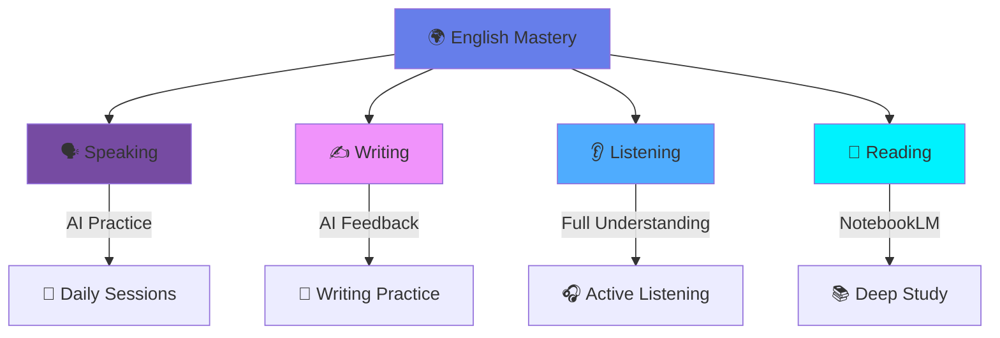
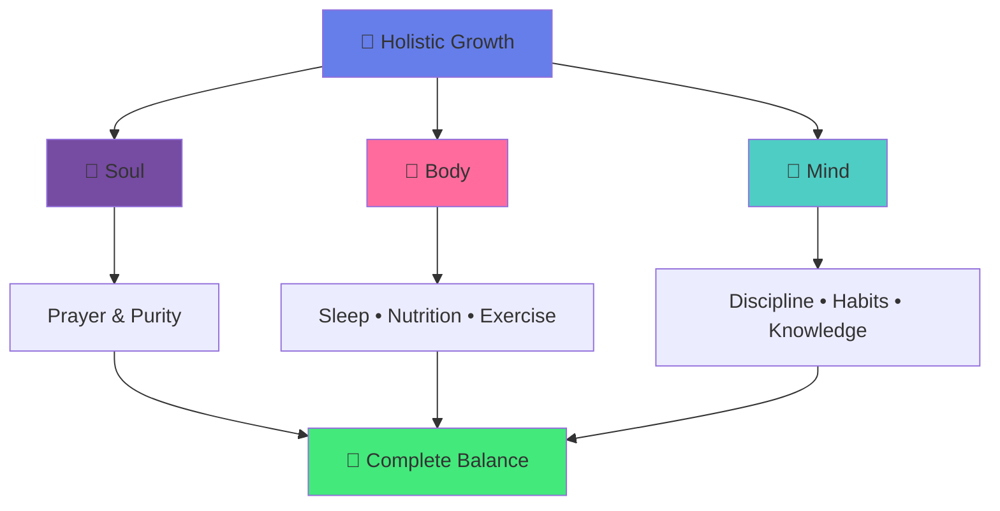
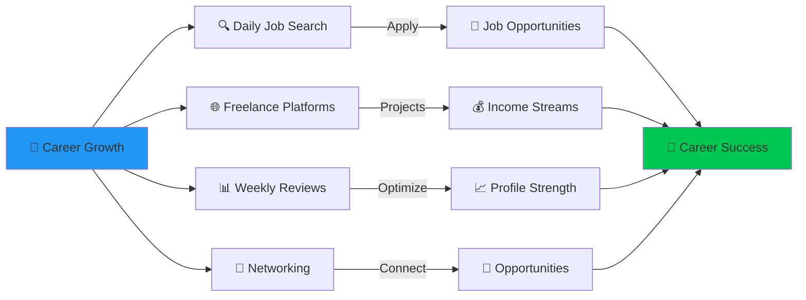

<div align="center">

<!-- Animated Header -->


<h3>
  
</h3>

[](https://duolingo.com)
[](#)
[](#)


</div>

---

## 🎯 Journey Overview

<div align="center">

<table>
<tr>
<td align="center" width="33%" style="border: 2px solid #667eea; padding: 30px; background: linear-gradient(135deg, #667eea 0%, #764ba2 100%);">

<br><br>
<h3>English</h3>
<sub>Language Mastery</sub>
</td>
<td align="center" width="33%" style="border: 2px solid #FF6B9D; padding: 30px; background: linear-gradient(135deg, #FF6B9D 0%, #C44569 100%);">

<br><br>
<h3>Holistic Growth</h3>
<sub>Mind • Soul • Body</sub>
</td>
<td align="center" width="33%" style="border: 2px solid #4ECDC4; padding: 30px; background: linear-gradient(135deg, #4ECDC4 0%, #556270 100%);">

<br><br>
<h3>Career</h3>
<sub>Jobs & Freelance</sub>
</td>
</tr>
</table>

</div>

<div align="center">

</div>

---

## 🌍 R → English Language Mastery

<div align="center">

### 📚 Comprehensive Language Development


</div>

<details open>
<summary><b>🗣️ Speaking Mastery (Click to expand)</b></summary>
<br>

| Icon | Activity | Tools & Methods |
|:----:|:---------|:----------------|
| 🤖 | **AI Conversation Practice** | Regular speaking sessions with AI assistants |
| 🎯 | **Daily Practice** | Consistent speaking exercises |
| 📱 | **Real-time Feedback** | AI-powered pronunciation correction |
| 🎙️ | **Voice Training** | Clarity, fluency, and confidence building |
| 💬 | **Conversational Skills** | Natural dialogue practice |

**Daily Goal:** 30+ minutes of active speaking practice with AI

</details>

<details open>
<summary><b>✍️ Writing Excellence (Click to expand)</b></summary>
<br>

| Icon | Activity | Tools & Methods |
|:----:|:---------|:----------------|
| 🤖 | **AI-Assisted Writing** | Regular writing sessions with AI feedback |
| 📝 | **Grammar & Style** | Real-time corrections and improvements |
| 📄 | **Various Formats** | Essays, emails, articles, creative writing |
| 🔍 | **Vocabulary Building** | Context-based word learning |
| ✨ | **Refinement Practice** | Editing and polishing skills |

**Daily Goal:** Write at least 500 words with AI review

</details>

<details open>
<summary><b>👂 Listening Comprehension (Click to expand)</b></summary>
<br>

| Icon | Activity | Tools & Methods |
|:----:|:---------|:----------------|
| 🎧 | **Active Listening** | Everything I listen to, I understand completely |
| 📚 | **Course Focus** | Understanding every word in educational content |
| 🎬 | **Media Consumption** | Movies, podcasts, audiobooks |
| 🔄 | **Repeat & Review** | Re-listen until full comprehension |
| 📊 | **Comprehension Check** | Self-testing and verification |

**Core Principle:** Never move forward without understanding everything

</details>

<details open>
<summary><b>📖 Reading Mastery (Click to expand)</b></summary>
<br>

| Icon | Activity | Tools & Methods |
|:----:|:---------|:----------------|
| 📚 | **NotebookLM Study** | Deep analysis of every book |
| 🔍 | **Comprehensive Reading** | Understanding every detail |
| 📝 | **Note-Taking** | Active reading with annotations |
| 🧠 | **Retention Focus** | Memorization and recall practice |
| 💡 | **Application** | Using learned concepts in practice |

**Method:** Study every book thoroughly with NotebookLM assistance

</details>

<div align="center">

### 🎯 Four Pillars of Language Mastery



</div>


---

## 🧘 R → Mind & Soul & Body

<div align="center">

### ⚖️ Holistic Personal Development


</div>

<details open>
<summary><b>🕌 Soul - Spiritual Foundation (Click to expand)</b></summary>
<br>

| Icon | Practice | Commitment |
|:----:|:---------|:-----------|
| 🕌 | **Five Daily Prayers** | Pray all five prayers on time, every day |
| ✨ | **Spiritual Purity** | Stay away from all sins |
| 🛡️ | **Self-Control** | Especially avoid sins that arouse sexual desire |
| 📿 | **Mindfulness** | Present in every prayer |
| 💫 | **Connection** | Strengthen relationship with Allah |

**Core Value:** Spiritual discipline is the foundation of all success

</details>

<details open>
<summary><b>💪 Body - Physical Excellence (Click to expand)</b></summary>
<br>

| Icon | Practice | Schedule |
|:----:|:---------|:---------|
| 😴 | **Sleep Schedule** | 10 PM - 5 AM (7 hours quality sleep) |
| 🍽️ | **Three Meals Daily** | Breakfast • Lunch • Dinner |
| 💊 | **Daily Supplements** | Take all supplements consistently |
| 🤸 | **Calisthenics Training** | Regular bodyweight exercise routine |
| 🏃 | **Physical Activity** | Build strength, flexibility, endurance |

### 📅 Daily Physical Routine

```
05:00 AM - Wake Up (After Fajr Prayer)
06:00 AM - Calisthenics Training
08:00 AM - Breakfast + Supplements
01:00 PM - Lunch
07:00 PM - Dinner + Supplements
10:00 PM - Sleep
```

</details>

<details open>
<summary><b>🧠 Mind - Mental Mastery (Click to expand)</b></summary>
<br>

### 🎯 Core Mental Development

| Icon | Focus Area | Implementation |
|:----:|:-----------|:---------------|
| ⚡ | **Discipline** | Master self-control in all areas |
| 🔄 | **Habit Building** | Establish and maintain positive routines |
| ⏰ | **Time Management** | Optimize every hour of the day |
| 📚 | **Reading** | Read all the books I have systematically |
| 🎮 | **Dopamine Control** | Generate dopamine naturally + Stop consuming artificial dopamine |

### 🤖 AI & Learning Strategy

| Icon | Strategy | Purpose |
|:----:|:---------|:--------|
| 🧠 | **Use AI Less** | Build independent thinking |
| 🔍 | **Deep Understanding** | Deeply understand everything AI gives me |
| 📖 | **Active Learning** | Don't just copy-paste, learn the concepts |
| 💡 | **Critical Thinking** | Question and verify information |

### 💪 Mental Toughness Development

| Icon | Area | Development |
|:----:|:-----|:------------|
| 🧠 | **Mental Toughness** | Resilience and focus under pressure |
| 🤝 | **Psychological Toughness** | Emotional control and stability |
| 💪 | **Physical Toughness** | Push through physical challenges |

### 🎓 Personal Growth Content

| Icon | Content | Purpose |
|:----:|:--------|:--------|
| 🎬 | **Amr Abdelaziz Videos** | Watch to understand: |
| ❓ | **Who You Are** | Self-awareness and identity |
| 🌍 | **What Got Us Here** | Understanding history and context |
| ✅ | **Your Duties** | Clear understanding of responsibilities |

</details>

<div align="center">

### 🌟 The Three Pillars of Holistic Growth



</div>


---

## 💼 R → Money & Jobs & Freelancer

<div align="center">

### 🚀 Career Development & Financial Growth


</div>

<details open>
<summary><b>🔍 Daily Job Search Strategy (Click to expand)</b></summary>
<br>

| Icon | Activity | Frequency |
|:----:|:---------|:----------|
| 🔎 | **Search for Jobs** | Every single day |
| 📝 | **Apply to Positions** | Apply immediately when suitable |
| 🎯 | **Target Companies** | Focus on aligned opportunities |
| 📊 | **Track Applications** | Monitor status and follow-ups |
| 🔄 | **Consistency** | Never skip a day |

**Daily Goal:** Apply to at least 3-5 relevant positions

</details>

<details open>
<summary><b>🌐 Freelance Platform Management (Click to expand)</b></summary>
<br>

### 📱 Mostaql - Ongoing Monitoring

| Icon | Action | Frequency |
|:----:|:-------|:----------|
| 👀 | **Check Mostaql** | Multiple times throughout the day |
| ⚡ | **Quick Response** | Respond to opportunities immediately |
| 📋 | **Proposal Quality** | Write compelling, customized proposals |
| 🎯 | **Selective Bidding** | Focus on projects matching skills |

### 🛍️ Khamsat - Product Development

| Icon | Action | Frequency |
|:----:|:-------|:----------|
| 📚 | **Study & Improve** | Regular account optimization |
| 🎨 | **Add Projects** | Create sellable services/products |
| 💰 | **Pricing Strategy** | Competitive and valuable offerings |
| ⭐ | **Quality Focus** | Excellence in every service |

</details>

<details open>
<summary><b>📊 Weekly Profile Review & Optimization (Click to expand)</b></summary>
<br>

### 🗓️ Every Week - Complete Profile Audit

| Platform | Review Focus | Action Items |
|:---------|:-------------|:-------------|
| 📄 **CV** | Update with new skills & experiences | Keep fresh and relevant |
| 💼 **LinkedIn** | Profile completeness, posts, engagement | Active professional presence |
| 🔍 **Wuzzuf** | Job applications, profile optimization | Local market focus |
| 💻 **GitHub** | Project updates, contributions, README | Technical portfolio |
| 🌐 **Freelancer Profiles** | Mostaql, Khamsat, others | Consistent branding |

**Weekly Review Checklist:**
- ✅ Update all profiles with latest information
- ✅ Check profile completeness scores
- ✅ Review and improve profile descriptions
- ✅ Add new skills and certifications
- ✅ Update portfolio with recent work
- ✅ Check for spelling/grammar errors
- ✅ Optimize keywords for searchability

</details>

<details open>
<summary><b>🤝 Networking & Recommendations (Click to expand)</b></summary>
<br>

### 📧 Active Outreach Strategy

| Icon | Activity | Purpose |
|:----:|:---------|:--------|
| 📨 | **Send CV to People** | Proactive job hunting |
| 🌐 | **Expand Your Network** | Connect with industry professionals |
| 🔍 | **Find Recommenders** | Look for people who can recommend you |
| 💬 | **Engage Meaningfully** | Build real relationships, not just connections |
| 🎯 | **Strategic Networking** | Focus on mutually beneficial connections |

### 🌟 Networking Best Practices

- ✅ Personalize every message
- ✅ Offer value before asking for favors
- ✅ Follow up consistently
- ✅ Build genuine relationships
- ✅ Stay active and visible
- ✅ Share knowledge and help others

</details>

<div align="center">

### 💰 Career Growth Framework



</div>


---

## 📊 Daily Schedule & Routine

<div align="center">

### ⏰ Optimized Daily Timeline

</div>

<table>
<tr>
<td width="50%" valign="top">

#### 🌅 Morning (5 AM - 12 PM)
- **05:00** - Wake up after Fajr Prayer
- **05:30** - English practice (Speaking/Writing)
- **06:30** - Calisthenics training
- **07:30** - Shower & prepare
- **08:00** - Breakfast + Supplements
- **08:30** - Job search & applications
- **10:00** - Deep work (Skills/Projects)
- **12:00** - Dhuhr Prayer

</td>
<td width="50%" valign="top">

#### 🌞 Afternoon & Evening (12 PM - 10 PM)
- **12:30** - Continue deep work
- **01:00** - Lunch
- **02:00** - Reading/Learning time
- **03:30** - Asr Prayer
- **04:00** - Freelance platforms check
- **06:00** - Maghrib Prayer
- **07:00** - Dinner + Supplements
- **08:00** - Isha Prayer
- **08:30** - Review day & plan tomorrow
- **10:00** - Sleep

</td>
</tr>
</table>

---

## 🎯 Success Metrics & Progress Tracking

<div align="center">

### 📈 Key Performance Indicators

<table>
<tr>
<td align="center">
<h3>🗣️</h3>
<b>English Mastery</b>
<br>
<sub>Daily practice all 4 skills</sub>
</td>
<td align="center">
<h3>🧘</h3>
<b>Holistic Balance</b>
<br>
<sub>Mind • Soul • Body alignment</sub>
</td>
<td align="center">
<h3>💼</h3>
<b>Career Growth</b>
<br>
<sub>Daily applications & networking</sub>
</td>
<td align="center">
<h3>📚</h3>
<b>Continuous Learning</b>
<br>
<sub>Books • Courses • Practice</sub>
</td>
</tr>
</table>

</div>

---

## 🌟 Core Principles & Philosophy

<div align="center">

| Principle | Implementation | Expected Outcome |
|:---------:|:---------------|:-----------------|
| 🎯 **Discipline** | Stick to schedule and commitments | Consistent progress |
| 🔄 **Consistency** | Show up every single day | Compound growth |
| 📊 **Measurement** | Track progress weekly | Data-driven improvement |
| 💪 **Resilience** | Push through challenges | Mental toughness |
| 🌱 **Growth Mindset** | Always learning and improving | Continuous evolution |
| ⚖️ **Balance** | Integrate all life areas | Holistic success |

</div>

---

## 🚀 Mission Statement

<div align="center">

### 💡 *"Success is the sum of small efforts repeated day in and day out."*


**My Mission:** To achieve mastery in English, balance in mind-soul-body, and success in my career through **discipline, consistency, and continuous improvement.**

### 🎯 Three Pillars of Success

```
🌍 English Mastery  →  🧘 Holistic Growth  →  💼 Career Excellence
        ↓                      ↓                       ↓
    Fluency &              Balance &              Financial &
   Confidence            Well-being            Professional Success
```

<sub>⭐ Commit to the journey, trust the process, and watch yourself transform!</sub>
<br>
<sub>📅 Last Updated: October 2025</sub>


</div>
